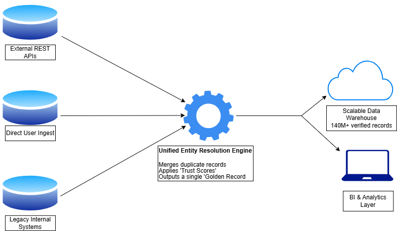

# High-Volume Entity Resolution & Truth Engine 🚀

## 📖 Overview
In large-scale data ecosystems, "Identity" is often fragmented. When ingesting data from disparate REST APIs, legacy internal systems, and direct user uploads, the same entity frequently appears with conflicting attributes or varied naming conventions.

This project is a high-performance **Entity Resolution Engine** designed to ingest, deduplicate, and verify over **140 Million records**. It utilizes a **Weighted Provenance Model** to resolve data conflicts and establish a single, trusted "Golden Record" for downstream analytics.

---

## 🏗️ The Architecture (Medallion Pattern)

The system is built on a local-first, high-efficiency stack designed to handle massive throughput without the overhead of expensive cloud compute.

* **Bronze Layer (Ingestion):** A metadata-driven Python harvester targets external REST APIs and legacy CSV/Excel archives, persisting raw data into compressed **Apache Parquet** files.
* **Silver Layer (Processing):** Leveraging **DuckDB** for lightning-fast, in-memory SQL processing. This layer performs:
    * **Canonical Mapping:** Normalizing varied naming conventions.
    * **Deduplication:** Merging records based on taxonomic roots and unique identifiers.
    * **Trust Scoring:** Applying a weighted confidence score to each source (e.g., prioritizing verified field data over public crowdsourced data).
* **Gold Layer (Persistence):** Finalized "Golden Records" are bulk-upserted into a **PostgreSQL** data warehouse, serving as the "Sovereign Truth" for BI tools and real-time dashboards.

---

## 🛠️ Tech Stack
* **Language:** Python 3.11+
* **Processing Engine:** DuckDB (High-performance analytical database)
* **Storage:** PostgreSQL (Relational) & Apache Parquet (Columnar)
* **Methodology:** Medallion Architecture, Metadata-Driven Orchestration

---

## 🚀 Key Engineering Wins
* **Scale:** Engineered to process **140M+ records** on standard local hardware by optimizing memory usage with DuckDB.
* **Flexibility:** The system is entirely metadata-driven; adding a new data source requires zero code changes—only a simple update to the JSON source registry.
* **Accuracy:** Implemented a Conflict Resolution logic that ensures the highest-quality data "wins" based on source reliability metrics.
* **Cost Efficiency:** Eliminated the need for expensive cloud-based Document Intelligence or OCR services by architecting a local-first processing pipeline.

---

## 📊 Performance Metrics
* **Throughput:** Capable of processing 10M+ records per batch in sub-10 minute windows.
* **Storage:** Achieved an **80% reduction** in raw data footprint by utilizing Parquet's columnar compression.

---

## 📝 Usage & Disclosure
*Note: The core processing logic and specific data sources are part of a private, confidential project. This repository serves as an architectural demonstration of the system's design and technical capabilities.*
